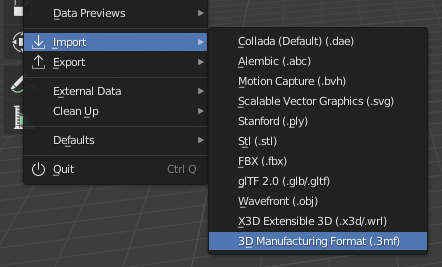

Blender 3MF Format
====
This is a Blender add-on that allows importing and exporting 3MF files.

3D Manufacturing Format files (.3mf) are a file format for triangular meshes intended to serve as exchange format for 3D printing applications. They can communicate not only the model, but also the intent and material of a 3D printing job from the CAD software to the CAM software (slicer). In this scenario, Blender serves as the CAD software. To that end, the aim of this add-on is to make Blender a more viable alternative as CAD software for additive manufacturing.

Installation
----
This add-on requires Blender 2.80 or newer.

To install this add-on, currently you need to tell Blender where to find a .zip archive with the add-on inside.
1. Download the latest release from the [releases page](https://github.com/Ghostkeeper/Blender3mfFormat/releases/latest). This is a .zip archive.
2. In Blender, go to Edit -> Preferences and open the Add-ons tab on the left.
3. Click on the Install... button at the top. Navigate to the .zip you downloaded.
4. Under the "Testing" category, find the add-on called "Import-Export: 3MF format". Make sure that it's enabled. (Note: If searching with the search box, exclude the "Import-Export" text since this is the category, not part of the add-on name. Just search for "3MF" instead.)

Usage
----
When this add-on is installed, a new entry will appear under the File -> Import menu called "3D Manufacturing Format". When you click that, you'll be able to select 3MF files to import into your Blender scene. A new entry will also appear under the File -> Export menu with the same name. This allows you to export your scene to a 3MF file.

The following options are available when importing 3MF files:
* Scale: A scaling factor to apply to the scene after importing. All of the mesh data loaded from the 3MF files will get scaled by this factor from the origin of the coordinate system. They are not scaled individually from the centre of each mesh, but all from the coordinate origin.

The following options are available when exporting to 3MF:
* Selection only: Only export the objects that are selected. Other objects will not be included in the 3MF file.
* Scale: A scaling factor to apply to the models in the 3MF file. The models are scaled by this factor from the coordinate origin.
* Apply modifiers: Apply the modifiers to the mesh data before exporting. This embeds these modifiers permanently in the file. If this is disabled, the unmodified meshes will be saved to the 3MF file instead.
* Precision: Number of decimals to use for coordinates in the 3MF file. Greater precision will result in a larger file size.

Support
----
This add-on currently supports the full [3MF Core Specification](https://github.com/3MFConsortium/spec_core/blob/1.2.3/3MF%20Core%20Specification.md) version 1.2.3. However there are a number of places where it deviates from the specification on purpose.

The 3MF specification demands that consumers of 3MF files (i.e. importing 3MF files) must fail quickly and catastrophically when anything is wrong. If a single field is wrong, the entire archive should not get loaded. This add-on has the opposite approach: If something small is wrong with the file, the rest of the file can still be loaded, but for instance without loading that particular triangle that's wrong. You'll get an incomplete file and a warning is placed in the Blender log.

The 3MF specification is also not designed to handle loading multiple 3MF files at once, or to load 3MF files into existing scenes together with other 3MF files. This add-on will try to load as much as possible, but if there are conflicts with parts of the files, it will load neither. One example is the scene metadata such as the title of the scene. If loading two files with the same title, that title is kept. However when combining files with multiple titles, no title will be loaded.

No 3MF extensions are currently supported. That is a goal for future development.
